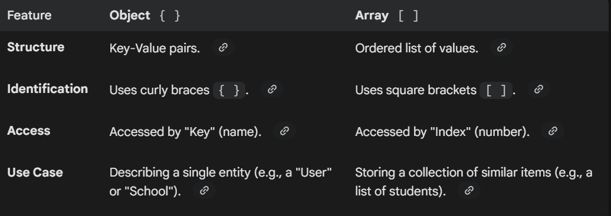

### Arrays
they can hold strings, numbers, objects, or even other arrays all at once. 
## 1. Creating and Accessing Arrays
The most common way to create an array is using array literals (square brackets).

## 2. Common Array Methods
JavaScript provides a rich set of built-in methods to manipulate data. These are generally divided into two categories: Mutating (changes the original array) and Non-mutating (returns a new array).

## Adding/Removing Elements
push(): Adds to the end.

pop(): Removes from the end.

unshift(): Adds to the beginning.

shift(): Removes from the beginning.

